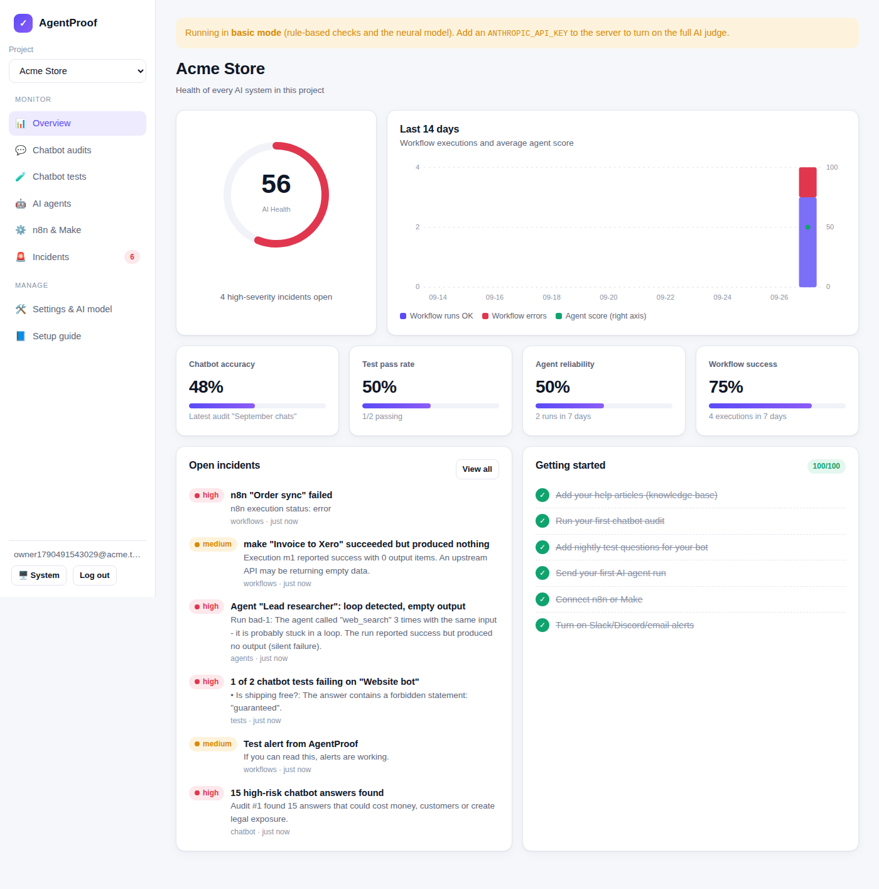

# ProofMyAI: prove your AI works

ProofMyAI is a quality-monitoring SaaS for small businesses and agencies that run **AI chatbots, AI agents and n8n/Make automations**. It catches wrong answers, broken agents and silent workflow failures before customers notice, and tells you exactly what to fix.

| Module | What it does |
|---|---|
| 💬 **Chatbot audits** | Upload transcripts (CSV/JSON from Intercom, Tidio, Crisp, Zendesk, any bot). Every answer is graded against your help docs: *correct, not in docs, made up, should escalate, off policy, unclear*. A **fix list** groups problems by the help article that caused them. |
| 🧪 **Nightly chatbot tests** | Save important questions and the facts a correct answer must contain. ProofMyAI calls your bot's HTTP endpoint every 24 h and alerts you when an answer breaks. |
| 🤖 **AI agent monitoring** | One HTTP call per agent run. Detects loops, tool errors, runaway cost/steps/time, empty output, "success" that ended on an error, and (with the AI judge) goals not met or claims the tools never returned. |
| ⚙️ **n8n & Make monitoring** | Connect with an API key or a webhook. Detects failures, silent failures (success with 0 output), slow runs, error-rate spikes and workflows that stopped running. |
| 🚨 **Incidents & alerts** | Deduplicated incidents with Slack / Discord / Teams / Google Chat webhooks and email (Resend). |
| 🧠 **Neural risk model** | Users mark verdicts right or wrong. A dependency-free deep neural network (2 hidden layers, Adam, early stopping) trains per project on that feedback and re-ranks answers by *that business's* notion of risk. Training data exports as JSONL for fine-tuning larger models later. |



## Quick start (local)

Requirements: **Node.js 22.13 or newer**.

```bash
npm install
cp .env.example .env        # then edit APP_SECRET and CRON_SECRET
npm run dev                 # http://localhost:3000
```

Without an AI key the app runs in **basic mode** (rule-based judge + neural model). Add `ANTHROPIC_API_KEY` (Claude) or `GEMINI_API_KEY` (Google Gemini, free tier available) to turn on the AI judge. See `.env.example` for `JUDGE_PROVIDER` and `GEMINI_MODEL`.

Try it with the files in [`examples/`](examples): upload `kb-*.txt/md` as the knowledge base and `sample-chats.csv` as an audit.

## Commands

| Command | Purpose |
|---|---|
| `npm run dev` | Development server |
| `npm test` | 42 unit/integration tests (engine, neural network, parsers, security, monitoring) |
| `npm run typecheck` | Strict TypeScript check |
| `npm run build && npm start` | Production build and server |
| `docker compose up -d` | Production via Docker with a persistent `/data` volume |

## Documentation

- **[docs/GUIDE.md](docs/GUIDE.md)**: the complete step-by-step guide (run, deploy, go live, get customers)
- **[docs/API.md](docs/API.md)**: ingestion API reference for agents and workflows
- **[docs/market-research.md](docs/market-research.md)**: the research behind the product

## Tech

Next.js 15 (App Router, server actions) · TypeScript · SQLite via Node's built-in `node:sqlite` · Anthropic SDK (Claude as judge, structured outputs, prompt caching, server-side refusal fallbacks) · pure-TypeScript neural network · zero client-side chart libraries (SVG).

```
src/
  app/                 pages, server actions and API routes
  components/          UI kit, charts, client widgets
  lib/
    judge/             AI judge (Claude), rule-based judge, feature extraction
    ml/                neural network (mlp.ts) + per-project risk model
    audit/             transcript parsing and audit pipeline
    agents/            agent-run checks and ingestion
    workflows/         n8n/Make pollers and monitoring rules
    tests/             nightly chatbot test runner
tests/                 vitest suites
```
